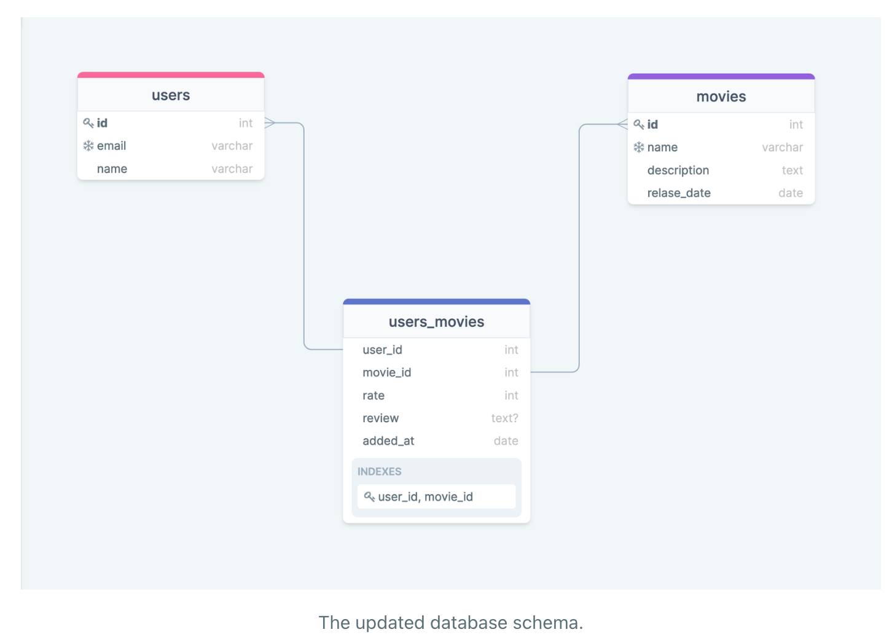

# spring-boot-many-to-many-sample

### Things todo list:

1. Clone this repository: `git clone https://github.com/hendisantika/spring-boot-many-to-many-sample.git`
2. Navigate to the folder: `cd spring-boot-many-to-many-sample`
3. Change DB credentials with your own on application.properties file
4. Run the application: `mvn clean spring-boot:run`
5. Check the logs

```shell
The user John Doe gave a rate of 4 to the movie Movie 1
The user John Doe gave a rate of 5 to the movie Movie 2
```

### Diagram

